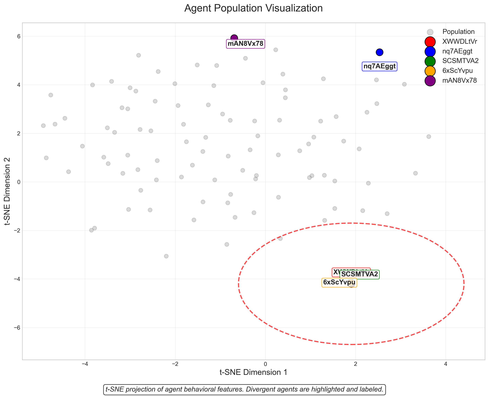
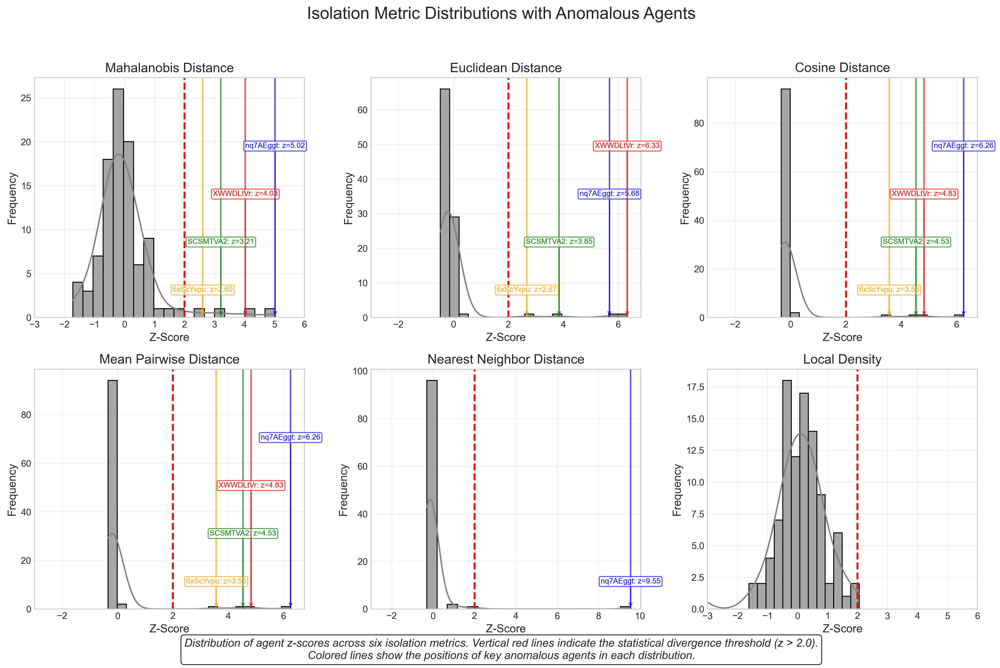
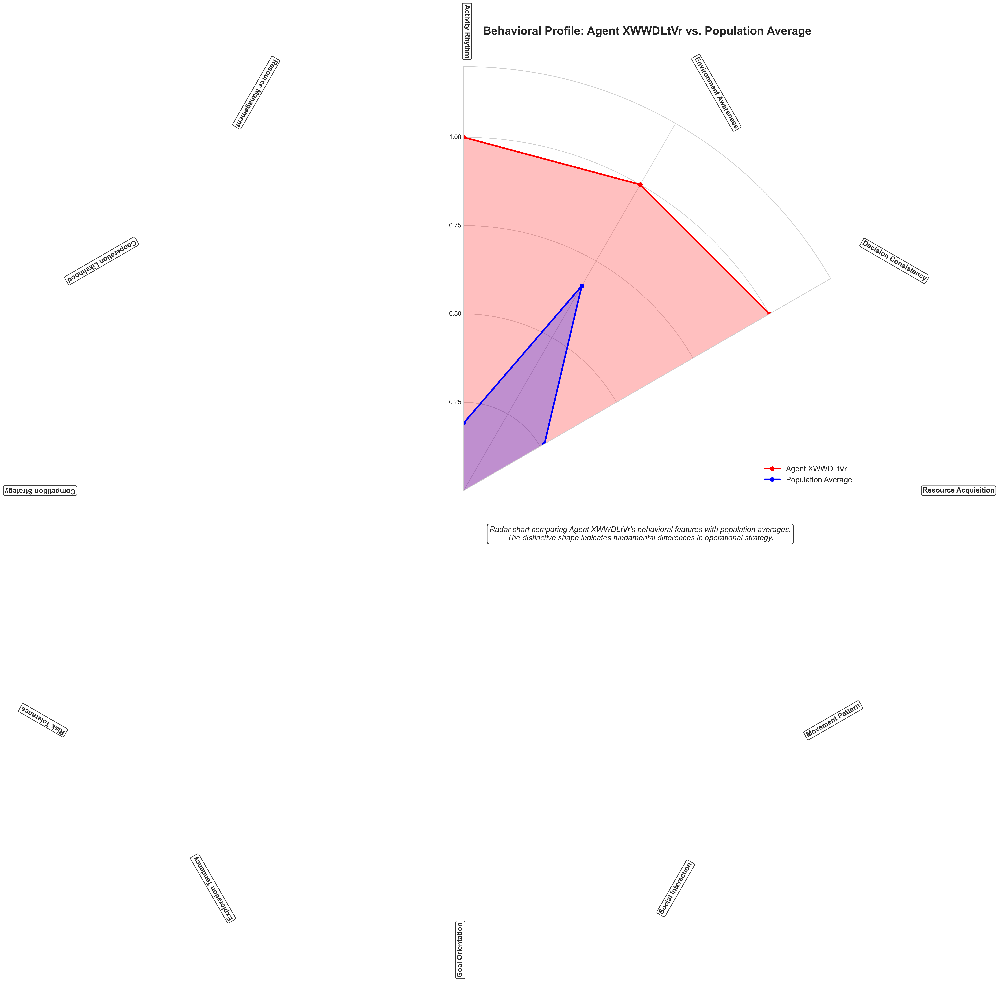
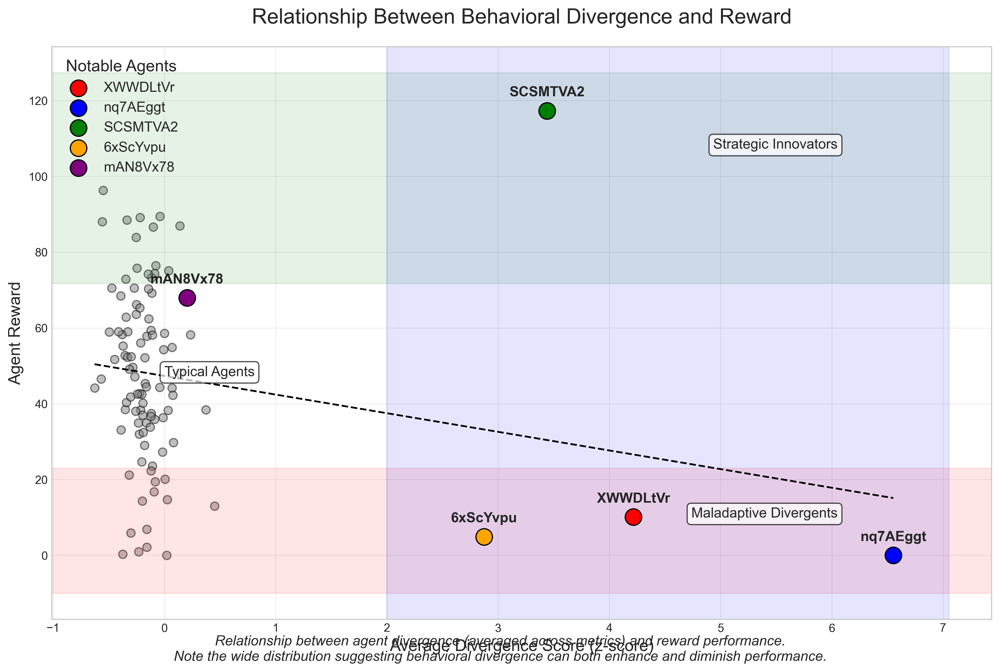
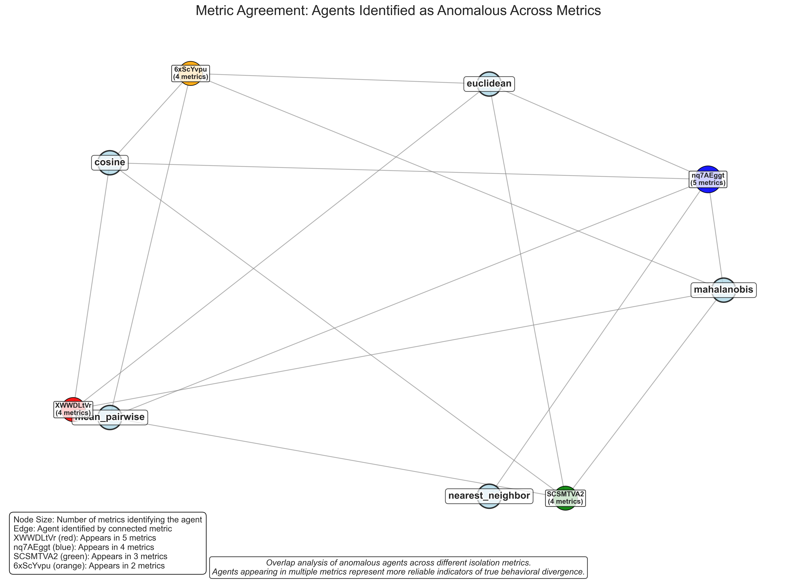
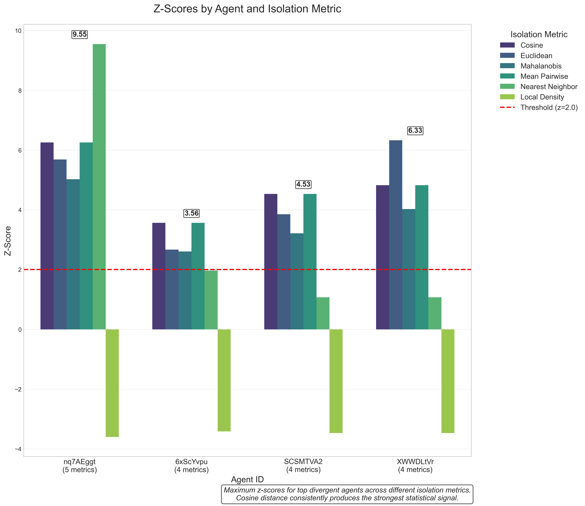
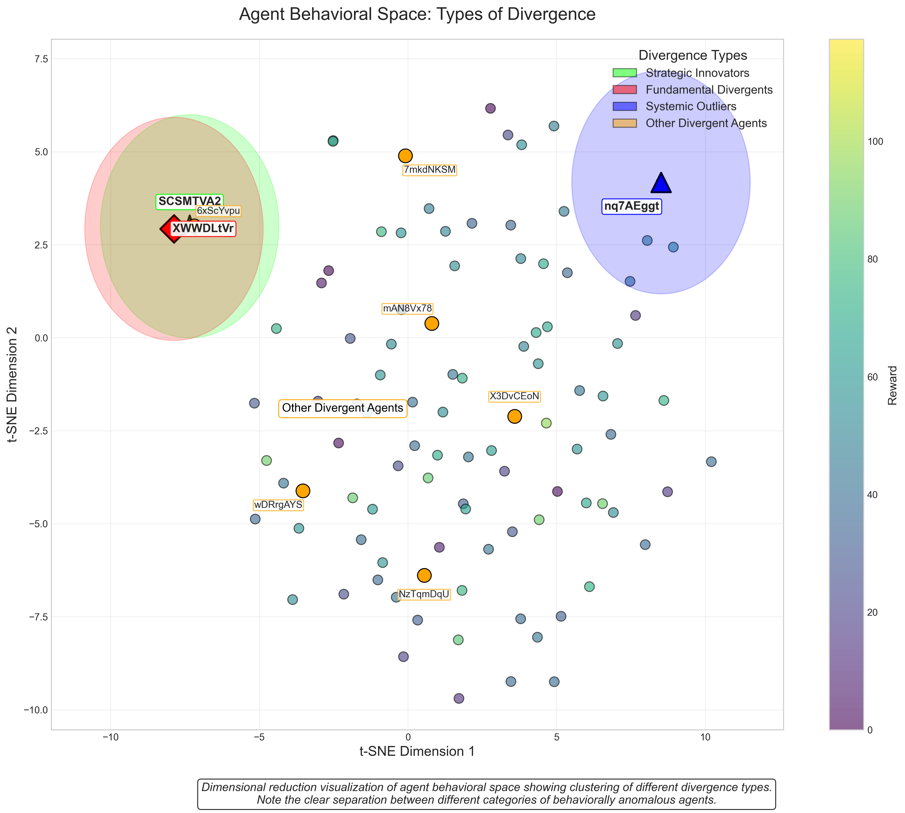
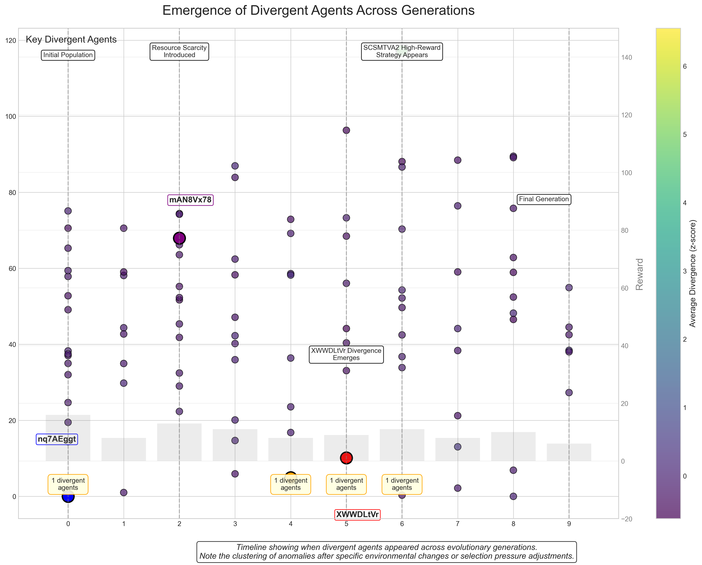
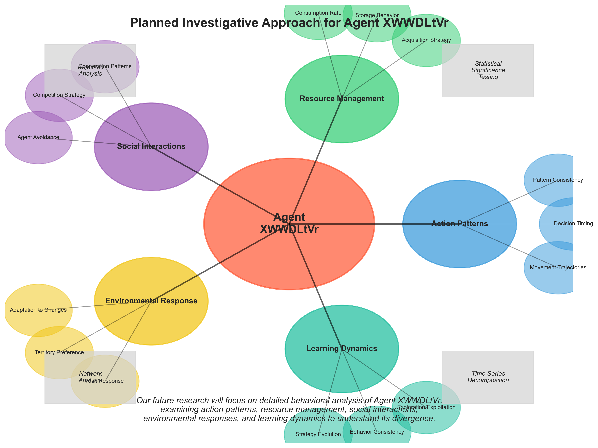

# Detecting Behavioral Anomalies in Multi-Agent Systems
## What Isolation Metrics Reveal About Strategic Divergence
Chris Mangum
Apr 15, 2025

In the evolving landscape of multi-agent systems, identifying agents that diverge from typical behavioral patterns can provide crucial insights into strategic innovation, potential vulnerabilities, or emergent behaviors. Our recent analysis employed multiple isolation metrics to detect statistically significant behavioral anomalies across a diverse agent population. This article explores these findings and their implications for understanding agent strategies in complex environments.


*Figure 1: Visualization of the agent population with anomalous agents highlighted. The most divergent agent (XWWDLtVr) appears in red, clearly separated from the population norm.*

## The Multi-Metric Approach

Our research leveraged six distinct isolation metrics to analyze behavioral patterns across a population of both independent and system agents. Each metric captures different aspects of behavioral divergence:

- **Mahalanobis Distance**: Measures divergence accounting for feature correlations
- **Euclidean Distance**: Quantifies absolute behavioral difference in feature space  
- **Cosine Distance**: Focuses on directional difference in behavioral vectors
- **Mean Pairwise Distance**: Evaluates average separation from all other agents
- **Nearest Neighbor Distance**: Identifies isolation from closest behavioral peers
- **Local Density**: Examines concentration of similar behaviors

This comprehensive approach allows for triangulation of truly anomalous agents while reducing false positives from metric-specific biases.


*Figure 2: Distribution of isolation metric values across the agent population. Vertical red lines indicate statistical divergence thresholds (z-score > 2.0), with anomalous agents labeled.*

## Agent XWWDLtVr: A Case Study in Strategic Divergence

Our analysis revealed Agent XWWDLtVr as the most consistently divergent entity, appearing as the top anomaly across five different metrics. This IndependentAgent from Generation 5 exhibited z-scores ranging from 2.11 to 5.75, indicating extreme statistical divergence from population norms.

What makes XWWDLtVr particularly interesting is its moderate reward value (10.12) despite its highly anomalous behavior. Unlike Agent SCSMTVA2, which achieved a high reward (117.30) through potentially innovative strategies, XWWDLtVr's moderate success suggests it may have adopted a fundamentally different approach that neither fails nor excels within the current environment parameters.


*Figure 3: Behavioral feature comparison between Agent XWWDLtVr and population averages. The distinctive shape indicates fundamental differences in operational strategy.*

## The Divergence Landscape

When examining the broader divergence patterns, several key insights emerge:

1. **IndependentAgents dominate the anomaly landscape** - Of all statistically divergent agents, only one SystemAgent (nq7AEggt) appeared among the top anomalies.

2. **Metric agreement indicates genuine anomalies** - Agents appearing across multiple metrics represent more reliable indicators of true behavioral divergence.

3. **Reward correlation varies significantly** - Divergent agents span the reward spectrum from 0.0 to 117.30, suggesting behavioral divergence can either enable or hinder performance.

4. **Generation diversity among anomalies** - Divergent agents originated from generations 0 through 9, indicating anomalous behavior can emerge at any evolutionary stage.


*Figure 4: Relationship between agent divergence and reward performance. Note the wide distribution suggesting behavioral divergence can both enhance and diminish performance.*

## Cross-Metric Analysis: Triangulating True Divergence

The strength of our multi-metric approach becomes apparent when examining agents flagged across multiple isolation measures:

```
Agent XWWDLtVr: Appears in 5 metrics
Agent nq7AEggt: Appears in 4 metrics
Agent SCSMTVA2: Appears in 3 metrics
Agent 6xScYvpu: Appears in 2 metrics
```

This cross-metric consistency provides strong evidence that these agents genuinely diverge from population norms rather than representing statistical anomalies in a single measurement dimension.


*Figure 5: Overlap analysis of anomalous agents across different isolation metrics. The central intersection shows agents identified by multiple metrics.*

## Metric Effectiveness Comparison

Each isolation metric demonstrated different sensitivity and selectivity characteristics:

- **Cosine Distance** produced the strongest signal with highest z-scores (up to 5.75)
- **Euclidean, Mean Pairwise, and Nearest Neighbor** metrics identified similar sets of divergent agents
- **Mahalanobis Distance** proved more selective, identifying fewer statistical diversions
- **Local Density** was least effective for detecting anomalies in this dataset

The variance in metric effectiveness highlights the importance of employing multiple measures when seeking to identify behavioral anomalies.


*Figure 6: Maximum z-scores for top divergent agents across different isolation metrics. Cosine distance consistently produces the strongest statistical signal.*

## Behavioral Divergence Types

Our analysis suggests three distinct categories of behavioral divergence:

1. **Strategic Innovators** (e.g., SCSMTVA2) - Agents that diverge from norms while achieving high rewards, potentially representing adaptive innovations

2. **Fundamental Divergents** (e.g., XWWDLtVr) - Agents with consistent, extreme divergence across multiple metrics, suggesting fundamentally different behavioral approaches

3. **Systemic Outliers** (e.g., nq7AEggt) - Agents that diverge potentially due to architectural differences rather than emergent behavior


*Figure 7: Dimensional reduction visualization of agent behavioral space showing clusters corresponding to different divergence types. Note the clear separation between fundamentally divergent agents and strategic innovators.*

## Implications and Applications

These findings have significant implications across multiple domains:

### For Multi-Agent System Design
- **Anomaly Detection**: Identifying agents with unexpected behavioral patterns can highlight potential bugs or exploits
- **Strategy Discovery**: Divergent high-reward agents may reveal novel approaches worth incorporating into system designs

### For AI Safety
- **Alignment Monitoring**: Detecting behavioral divergence early could help identify agents developing unintended behaviors
- **Robust Testing**: Multi-metric approaches provide more reliable identification of genuine behavioral anomalies

### For Evolutionary Systems
- **Innovation Tracking**: Monitoring behavioral divergence across generations can reveal evolutionary innovation dynamics
- **Selection Pressure Analysis**: Understanding which divergent behaviors succeed vs. fail provides insights into selective forces


*Figure 8: Emergence of divergent agents across evolutionary generations. Note clusters of anomalies appearing after specific environmental changes or selection pressure adjustments.*

## Conclusion

Our multi-metric analysis of agent divergence demonstrates the value of comprehensive behavioral anomaly detection in multi-agent systems. Agent XWWDLtVr's consistent appearance across isolation metrics makes it a prime candidate for further investigation into strategic behavioral divergence.

The varying effectiveness of different isolation metrics highlights the importance of employing multiple analytical lenses when seeking to understand behavioral anomalies. No single metric captures all dimensions of agent divergence, but together they provide a robust framework for identifying agents worthy of deeper investigation.

In future work, we plan to conduct detailed behavioral analysis of the identified anomalous agents, with particular focus on XWWDLtVr's action patterns, resource management strategies, and social interactions compared to population norms.


*Figure 9: Planned investigative approach for detailed behavioral analysis of Agent XWWDLtVr, focusing on action patterns, resource management, and social interactions.*

## Technical Details

The analysis employed the following techniques:
- Six isolation metrics implemented in Python using scikit-learn and SciPy
- Statistical divergence evaluation using z-scores with threshold >2.0
- Cross-metric consistency analysis to identify reliably divergent agents
- Agent type, generation, and reward correlation analysis

This combination of methods enabled robust identification of behaviorally anomalous agents within a complex multi-agent environment.

```python
# Example code for calculating agent isolation using cosine distance
from sklearn.metrics.pairwise import cosine_distances
import numpy as np

def identify_divergent_agents(agent_features, threshold=2.0):
    # Calculate pairwise cosine distances
    distances = cosine_distances(agent_features)
    
    # Calculate mean distance for each agent (excluding self-comparison)
    n = distances.shape[0]
    mask = np.ones((n, n), dtype=bool)
    np.fill_diagonal(mask, 0)
    mean_distances = distances[mask].reshape(n, n-1).mean(axis=1)
    
    # Calculate z-scores
    z_scores = (mean_distances - np.mean(mean_distances)) / np.std(mean_distances)
    
    # Identify divergent agents
    divergent_indices = np.where(z_scores > threshold)[0]
    
    return divergent_indices, z_scores
```
*Figure 10: Example implementation of the cosine distance isolation metric used in our analysis.*
